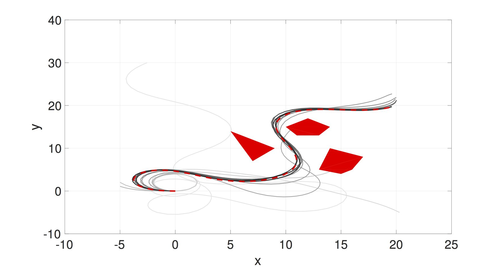

{:style="float: left;margin-left: 7px;margin-right: 7px;margin-top: 7px;margin-bottom: 7px" height="200"}

Planning of nonlinear robotic systems is NP-complete. Thus, approximate solutions have been investigated, such as discretization-based (A*) and sampling based (RRT*). We explore a different approximation scheme  —  **function approximation** —  that transforms the planning problem in state space or workspace to a planning problem in a parameter space for policy function approximation. A dimensionality reduction is achieved because the parameter space can be low dimensional, comparing to the state space. In our preliminary work, we introduced **importance sampling** to efficiently search for optimal feedback policy function approximation. See the left figure for applying the sampling-based algorithm for motion planning for a Dubins Car-like robot for goal reaching and obstacle avoidance. Lines from the initial sample to the last sample upon convergence vary from the lightest to darkest grey.

The algorithm supports parallel computation and anytime planning. Thus, it has the potential to take full advantage of scalable parallelization computing scheme in cloud robotics and GPU-accelerated robotics.

<iframe width="300" src="https://www.youtube.com/embed/zIt7lSJgWpc" title="YouTube video player" frameborder="0" allow="accelerometer; autoplay; clipboard-write; encrypted-media; gyroscope; picture-in-picture" allowfullscreen></iframe>

<iframe width="300" src="https://www.youtube.com/embed/WkkSpqLudss" title="YouTube video player" frameborder="0" allow="accelerometer; autoplay; clipboard-write; encrypted-media; gyroscope; picture-in-picture" allowfullscreen></iframe>

### Related Work

1. 
