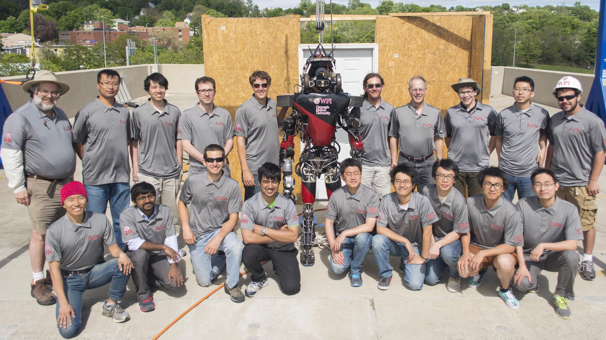

{:height="400"}

The DARPA Robotics Challenge (DRC) sought to develop human-supervised ground robots capable of executing complex tasks in dangerous, degraded environments — addressing disaster scenarios too hazardous for timely human response. The program advanced supervised autonomy, mobility, and dexterity, targeting effective robot operation by non-expert supervisors over degraded communications. DRC Trials were held in December 2013; Finals in June 2015. More information is available on the DRC program [website](https://archive.darpa.mil/roboticschallenge).

<iframe width="300" src="https://www.youtube.com/embed/BgfsxH3poCU" title="YouTube video player" frameborder="0" allow="accelerometer; autoplay; clipboard-write; encrypted-media; gyroscope; picture-in-picture" allowfullscreen></iframe>

<iframe width="300" src="https://www.youtube.com/embed/AvyGzqwOPSM" title="YouTube video player" frameborder="0" allow="accelerometer; autoplay; clipboard-write; encrypted-media; gyroscope; picture-in-picture" allowfullscreen></iframe>

### Related work:

1. 

2. 

3. 

4. 

5. 
